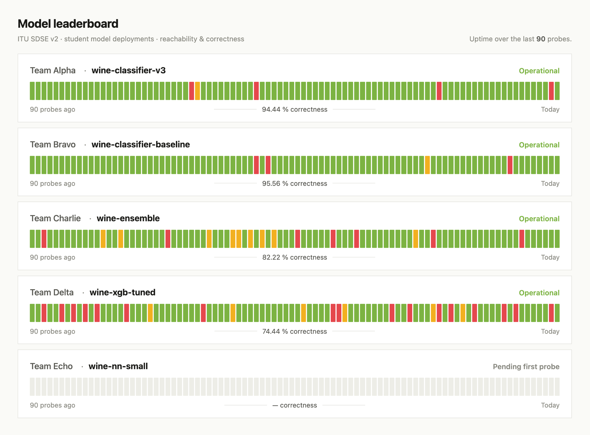
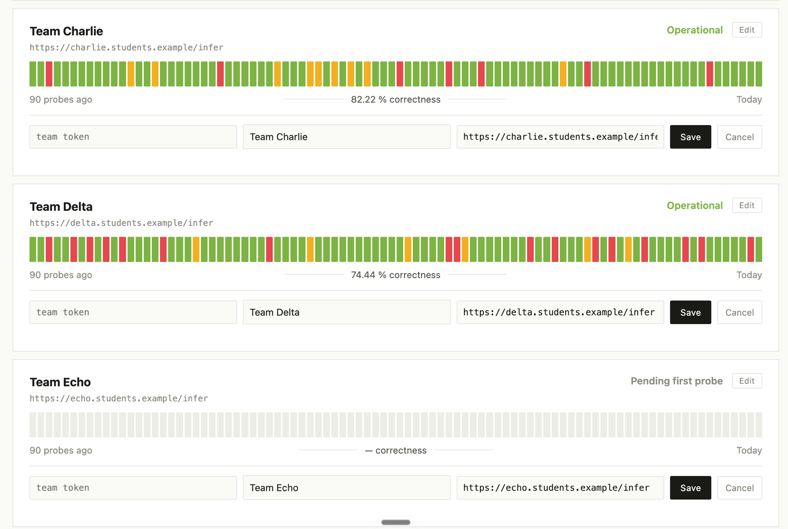

# v2 Dashboard — model leaderboard

Public, read-only leaderboard for the v2 exam extension. Every registered student model shows up as a row; the event engine probes each ready-for-events endpoint every few minutes and appends the result to the Status DB, which the dashboard renders as a Claude-Status-style strip of coloured bars.

Everything on this page is **WIP** — the dashboard runs today against a mock API (hardcoded data, no persistence). The row shape, colour semantics, and edit flow are what will ship; the numbers behind them will be real once the repository + event engine land.

> Related docs · [`platform/README.md`](../platform/README.md) — how to run the mock locally · [`../CLAUDE.md`](../CLAUDE.md) — full v2 plan · [`../CLARIFY.md`](../CLARIFY.md) — open questions.

---

## The row

Each team gets one row. Left to right:

| Region | What it shows |
|---|---|
| **Title (top-left)** | Team name in bold, with the model's public inference endpoint URL underneath in small monospace. The URL *is* the model's identity — there is no separate "model name" field. |
| **Status (top-right)** | Label derived from the most recent probe: `Operational` (green), `Degraded` (amber), `Unreachable` (red), or `Pending first probe` (grey — no probes yet). |
| **Strip (middle)** | 90 vertical bars, oldest on the left, newest on the right. One bar per probe. |
| **Footer (bottom)** | Three-column strip: `N probes ago` on the left, `<pct> % correctness` in the middle between two thin rules, `Today` on the right. |

### Bar colour semantics

Two indicators are recorded per probe — **reachability** (did the endpoint respond?) and **correctness** (was the prediction right?). The SPA collapses them into a single three-colour bar:

- 🟢 **Green** — reachable & correct
- 🟡 **Amber** — reachable but wrong prediction (drift-suspected)
- 🔴 **Red** — unreachable (endpoint down or misbehaving at the transport level)
- ⬜ **Grey (empty slot)** — no probe yet in that position; used for pending / short-history models so the row width stays consistent

### Headline metric

The centred percentage under the strip is **correctness %**, not raw uptime. That's what the exam actually grades — a model that reliably answers wrong is not a passing model. Uptime %, last-probe time, last-failure time, and successful-recovery count live in the (planned) row detail view, not in the compact row.

---

## Team register &amp; edit flow

New teams register at the bottom of the page; existing teams edit their row in place. Both are authenticated by a **team token** their lecturer issues once through the admin SPA.

### Register a new endpoint

At the bottom of the page:

1. Paste your team's token.
2. Paste your model's public inference URL (`https://…/infer`).
3. Hit **Register**.

The row appears immediately with an empty strip and `Pending first probe` status. The event engine picks it up on its next scheduled tick — but only once a lecturer flips `ready_for_events = true` in the admin SPA.

### Edit an existing row

1. Click **Edit** on your team's row.
2. Paste your team token in the leftmost field.
3. Change the team name or the endpoint URL (or both).
4. Hit **Save**.

Both fields require the token — you cannot edit another team's row, and you cannot change your own row anonymously. Errors (`unknown token`, `not your model`, `endpoint_url required`) surface inline in red under the panel.

---

## API surface (mock)

The SPA does one fetch per page load. The mock exposes three endpoints; the real API will keep the shapes identical:

- `GET /api/dashboard` — one-shot payload with `{generated_at, probe_window, models: [{model_id, team_name, endpoint_url, ready_for_events, probes, correctness_pct, uptime_pct, current_status, last_probe_at}]}`. Each entry in `probes[]` is one bar in visual order (oldest → newest) with `{reachable, correct}`.
- `POST /api/models` — register a new endpoint. Body: `{token, endpoint_url}`. Returns `201 {model_id, team_name}`.
- `PATCH /api/models/{model_id}` — edit an existing row. Body: `{token, team_name?, endpoint_url?}`. Token must belong to the row's owning team.

Auth errors are `401 unknown token` / `403 not your model`; validation errors are `400`; duplicate registration is `409`.

## Mock tokens

The mock ships six hardcoded tokens so you can exercise the register + edit flow without any DB behind it:

| Team | Token | State |
|---|---|---|
| Team Alpha | `tok-alpha-a1b2` | has a model — try **Edit** |
| Team Bravo | `tok-bravo-c3d4` | has a model — try **Edit** |
| Team Charlie | `tok-charlie-e5f6` | has a model — try **Edit** |
| Team Delta | `tok-delta-g7h8` | has a model — try **Edit** |
| Team Echo | `tok-echo-i9j0` | has a model, `ready_for_events = false` |
| Team Foxtrot | `tok-foxtrot-k1l2` | **no model yet — try the bottom Register form** |

Two mock-only caveats: **(a)** state lives in memory — restart uvicorn and any edits/registrations revert; **(b)** tokens are plaintext. In the real system these are per-team bcrypt-hashed passwords exchanged for a session token at login time (per `CLAUDE.md` §4 access control).

---

## Design decisions (pinned)

The compact row shape and its palette are pinned in `CLAUDE.md` → §2 with [`dashboard-reference.png`](./dashboard-reference.png) (Anthropic status page) as the visual anchor. Summary of the choices made so far:

- **Single strip, three colours** — chosen over two overlaid tracks. Reachability + correctness are stored independently in the Status DB; the SPA collapses them at render time.
- **Bar count fixed at 90** — matches the visual reference; window switcher deferred (simplicity rule).
- **Correctness % as the headline** — uptime %, last-probe time, and recovery count belong in a detail view, not the compact row.
- **Endpoint URL is the model's identity** — no separate `display_name` on the model row. URL renders small-mono under the team name so long URLs don't truncate the row title.
- **One model per team in v1** — schema allows more, UX doesn't need it yet.

Open questions live in [`../CLARIFY.md`](../CLARIFY.md) — most notably the file-DB shape (JSONL vs SQLite), lecturer-auth model for the admin SPA, and the exact definition of a recovery event.
